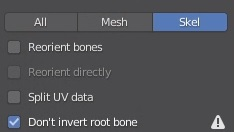
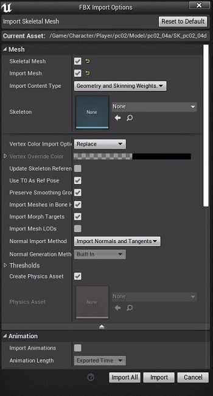
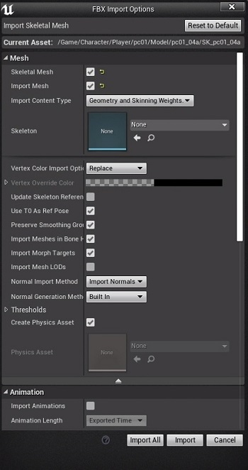

# How to use it?
First of all, you need to export the models in PSK and glTF with Umodel

## Blender
### Import PSK
Import only the first file with these settings:

### Import glTF
Import all files with default settings

### Scripting
Copy paste the script and replace PATH with the folder to which you want to export the fbx file

## Unreal Engine
Import the fbx inside Unreal Engine with the following settings:

NB: for Duran and Hawkeye, you must use these settings if you don't want weird hair:

# Credit
Script used to make the following mod:
https://www.nexusmods.com/trialsofmana/mods/110

If you use this script for making a mod, please credit me.